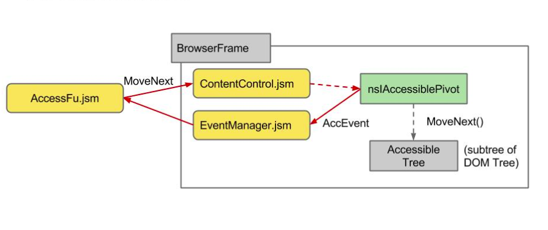

#ScreenReader
##Outline
* Introduction
* Screen Reader Architecture
  * Core Modules and Components
* Accessibility
* Speech Synthesis

##Introduction
###What is screen reader
**Web Accessibility Initiative-Accessible Reich Internet Application(WAI-ARIA)** is a w3c recommendation that can gain 
the accessibility to the disabilities. And screen reader is a text-to-voice software accessibility tool for mozilla.
###How to enable screen reader on B2G?

Open "Settings" >> choose "Developers" >> check "Show screen reader settings" under "debug" 
Back to "Settings" mune >> choose "Accessibility" >> Open "Screen Reader"

##Screen Reader Architecture
  There are two sides of screen reader, the parent side and the child side. The parent side is in charge of recording the user actions (e.g, gesture, key input), the visual cursor rendering and the reading voice. On the other hand, client side maintain an accessibility tree for each frame, it also contain a virsual cursor which indicates the target element in the tree.  
The following is the flow  when an user action occur, this action can be input like gesture, mouse scroll, key event:  
   
  Most of user actions like gesture and frame load will start from AccessFu.jsm and any target element change actions will go through ContentControl.jsm, including the action commands from parent side and the mouse move event which can be listened in content like arrow 1 in the figture. In arrow 2, ContentControl.jsm get the nsIAccessiblePivot via Utils.jsm and trigger it to update its position and fire an AccEvent. EventManager.jsm takes the AccEvent and other user actions that will change the visial position of visual cursor but not target element of nsIAccessiblePivot(e.g, scroll, whell, resize) then packs it via Presentation.jsm in arrow 4 and notifies the parent side to update the visual cursor and read the content like arrow 5 does.

###Core Modules and Components
####AccessFu.jsm
  AccessFu.jsm is imported by settings.js in shell.html. It is the mainly controller of screen reader. When a frame is loaded to the system, AccessFu.jsm will injects it with a script "content-script.js ", which will initializes ContentControl.jsm and EventManager.jsm. Also, AccessFu.jsm captures user actions including gestures, key inputs and transfers them to action commands then sends it to target frame for changing the visual corsur. Moreover, it listens to visual cursor updating message from content and rerenders the visual cursor and send the chrome message to system app for the voice reading.
####ContentControl.jsm
  ContentControl.jsm handles the action commands which will change nsIAccessiblePivot's target element, gets the virtual pivot interface nsIAccessiblePivot via Utils.jsm and makes it executes corresponding action.
####Utils.jsm
  Utils.jsm supports screen reader javascrupt modules the entry points to the commponent interfaces like Accessibility elements, Message Managers and Window elements.
####nsIAccessiblePivot
  Every nsIDocAccessible contains a nsIAccessiblePivot pointing to an Accessible element which indicates targeted element in this Accessibility tree. nsIAccessiblePivot can traverse Accessibility tree by its member functions(e.g, moveNext/movePrev/moveToPoint). After its traversal functions, it will fire an AccEvent for announcing status updating.
####EventManager.jsm
  EventManager.jsm listens to any event that will update the visual cursor's position like AccEvent for nsIAccessiblePivot position updating or the veiwport change event like scroll, wheel and resize.
####Presentation.jsm
  Presentation.jsm is an interface for all presenter classes. A presenter could be, for example, a speech output module, or a visual cursor indicator.

##Accessibility
  Accessibility is to providing people an easier way to access web. Check details in [Accessibility](https://developer.mozilla.org/en-US/docs/Web/Accessibility).
##Speech Synthesis
  

