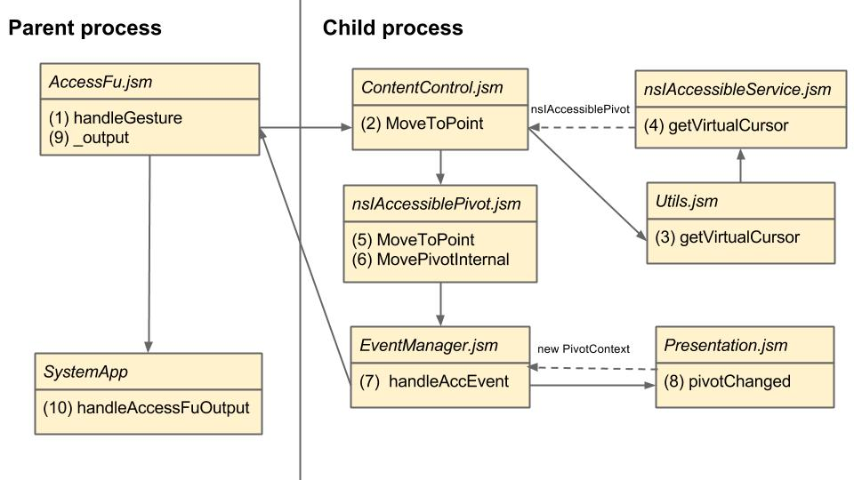

#ScreenReader
##Outline
##Introduction
###What is screen reader
**Web Accessibility Initiative-Accessible Reich Internet Application(WAI-ARIA)** is a w3c recommendation that can gain 
the accessibility to the disabilities. And screen reader is a text-to-voice software accessibility tool for mozilla.
###How to enable screen reader on B2G?

Open "Settings" >> choose "Developers" >> check "Show screen reader settings" under "debug" 
Back to "Settings" mune >> choose "Accessibility" >> Open "Screen Reader"

##Screen Reader Architecture
  There are two sides of screen reader, the parent side and the child side. The parent side captures the actions of keyinput, gesture or the tap change and send these as pivot movement commands to content process. Content process will accesses the accessibility tree to decide the position of pivot and send it back to b2g process for rendering of highlight box and speaking.  
  When enabling the screen reader, AccessFu.jsm will observes the frame-opend event[1], and injects the content-script.js to the opened frame and the content-script.js will then imports ContentControl.jsm and EventManager.jsm.  
  The following is the flow when user do a gesture action on screen :
  
When AccessFu capture the gesture, it will transfers it to the pivot action command and sends it to ContentControl.jsm. ContentControl.jsm will get the nsIAccessiblePivot via Utils.jsm, and then executes the virtual cursor changed action according the action command it received. The nsIAccessible pivot will traverse in Accessible tree to calculate the new position of the pivot and update it. After that, it will fire an AccEvent to notify the position renew. EventManager.jsm will catches this event and pack the information via Presentation.jsm and send it back to AccessFu.jsm by message manager. At last, AccessFu.jsm will reposition the higjlight box and speak the content.
###Accessibility
###Speech Synthesis

##Relative Bugs
