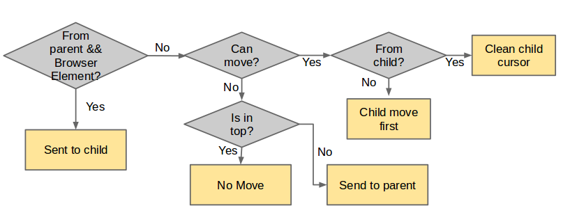

#ScreenReader
##Outline
* Introduction
* Screen Reader Architecture
  * Core Modules and Components
* Accessibility
* Speech Synthesis

##Introduction
###What is screen reader
**Web Accessibility Initiative-Accessible Reich Internet Application(WAI-ARIA)** is a w3c recommendation that can gain 
the accessibility to the disabilities. Screen reader is a text-to-voice software accessibility tool for mozilla. It is a feature of accessibility system. After enabling it, a pointer, called visual cursor, will show on the screen which indicates the current element system points to. User can then use some inputs like gesture or keyboard to control the visual cursor traverses through the elements on the screen and the system will read the content of the element where the visual cursor point to.
With this system, visual disable people can traverse elements in the screen without knowing element's relative position.
###How to enable screen reader on B2G?

Open "Settings" >> choose "Developers" >> check "Show screen reader settings" under "debug" 
Back to "Settings" mune >> choose "Accessibility" >> Open "Screen Reader"

##Screen Reader Architecture
  There are two parts of screen reader, the first part is AccessFu.jsm which is imported by shell.html, it is the controller part of screen reader system. It will listen to mozBroser-opened message and load content-script.js into the browser elements when they are opened. Also it listen to guestures and parts of keyboard input then pass the action command to target element. In the other hand, it deal with the output after the element moved like drawing visual cursor and trigger the TTS(text-to-speech) engine. 
  The other part is the browser contoller part, it contains modules like content-script.js, ContentControl.jsm and EventManager.jsm. Moreover, every browser element has an accessibility tree, it is a subtree of DOM tree. Also there is an pivot with nsIAccessiblePivot to indicate the currently focused element in accessibility tree. The main task of browser controller part is to manage the element traverse in accessibility tree.

###Move the visual cursor
There are two main steps to move the visual cursor. When receiving an action command, a browser element will traverse its own elements (intra-browser) or pass the movement action to other browser elements (inter-browse). 

The following is the flow of screen reader execute an action command:
 
  When browser receives an action command, it will check if the current pointing element is a browser element, if so, passes the comment to it via frame message manager so the screan reader can reach elements across browser elements.
  After the browser element checking, the browser element will try to move visual cursor inside itself; If it do can move, the browser element will move the visual cursor and do the browser element mentioned above again, if not, it will pass the command back to its parent to seek the oppotunity to move. 

  How does visual cursor move in the browser element? As we previously mention, there is an accessibility tree for every browser element. When browser element receives the action command, it can get access to the virtual cursor via ContentControl.jsm, and make the virtual cursor to traverse accessibility tree according the action command. If virtual cursor can move, it will send an AccEvent through EventManager.jsm to AccessFu.jsm to notice the focused element changed.
   

###Core Modules and Components
####AccessFu.jsm
  AccessFu.jsm is imported by settings.js in shell.html. It is the mainly controller of screen reader. When a frame is loaded to the system, AccessFu.jsm will inject it with a script "content-script.js ", which will initialize ContentControl.jsm and EventManager.jsm. Also, AccessFu.jsm captures user actions including gestures, key inputs and transfers them to action commands then sends it to target frame for changing the visual corsur. Moreover, it listens to visual cursor updating message from content and rerenders the visual cursor and send the chrome message to system app for the voice reading.
####ContentControl.jsm
  ContentControl.jsm handles the action commands which will change nsIAccessiblePivot's target element, gets the virtual pivot interface nsIAccessiblePivot via Utils.jsm and makes it execute corresponding action.
####Utils.jsm
  Utils.jsm supports screen reader javascript modules the entry points to the component interfaces like Accessibility elements, Message Managers and Window elements.
####nsIAccessiblePivot
  Every nsIDocAccessible contains a nsIAccessiblePivot pointing to an Accessible element which indicates targeted element in this Accessibility tree. nsIAccessiblePivot can traverse Accessibility tree by its member functions(e.g, moveNext/movePrev/moveToPoint). After its traversal functions, it will fire an AccEvent for announcing status updating.
####EventManager.jsm
  EventManager.jsm listens to any event that will update the visual cursor's position like AccEvent for nsIAccessiblePivot position updating or the veiwport change event like scroll, wheel and resize.
####Presentation.jsm
  Presentation.jsm is an interface for all presenter classes. A presenter could be, for example, a speech output module, or a visual cursor indicator.

##Accessibility
  Accessibility is to provide people an easier way to access web. Check details in [Accessibility](https://developer.mozilla.org/en-US/docs/Web/Accessibility).
##Speech Synthesis
  

