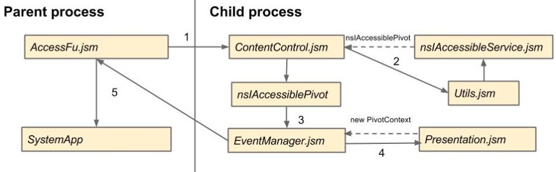

#ScreenReader
##Outline
##Introduction
###What is screen reader
**Web Accessibility Initiative-Accessible Reich Internet Application(WAI-ARIA)** is a w3c recommendation that can gain 
the accessibility to the disabilities. And screen reader is a text-to-voice software accessibility tool for mozilla.
###How to enable screen reader on B2G?

Open "Settings" >> choose "Developers" >> check "Show screen reader settings" under "debug" 
Back to "Settings" mune >> choose "Accessibility" >> Open "Screen Reader"

##Screen Reader Architecture
  There are two sides of screen reader, the parent side and the child side. The parent side is in charge of recording the user actions (e.g, gesture, key input), notifying the remote content which shouild reacts and handle the cursor update event from content side. On the other hand, after content side receive the visual cursor updating message from parent, it will traverses the accessibility tree according the given rule, resets its virtual pivot in its accessibility tree and reports the result back to parent side.  
###Core Modules and Components
  The following is the flow when user do a gesture action on screen :
  
####AccessFu.jsm
  AccessFu.jsm is imported by settings.js in shell.html. It is the mainly controller of screen reader. When a frame is loaded to the system, AccessFu.jsm will injects it with a script "content-script.js ", which will initializes ContentControl.jsm and EventManager.jsm. Also, AccessFu.jsm captures user actions including gestures, key inputs and transfers them to action commands then sends it to target frame. Moreover, it captures the visual updating message from content and rerender the visual cursor then send the chrome message to system app for remaining reactions.
####ContentControl.jsm
    ContentControl.jsm handles the action commands from parent side and, gets the virtual pivot interface nsIAccessiblePivot via Utils.jsm, and makes it executes corresponding action.
####Utils.jsm
  Utils.jsm supports screen reader javascrupt modules the entry points to the commponent interfaces like Accessibility elements, Message Managers and Window elements.
####nsIAccessiblePivot
  Every nsIDocAccessible contains a nsIAccessiblePivot pointing to an Accessible element which indicates targeted element in this Accessibility tree. nsIAccessiblePivot can traverse Accessibility tree by its member functions(e.g, moveNext/movePrev/moveToPoint). After its traversal functions, it will fire an AccEvent for announcing status updating.
####EventManager.jsm
  EventManager.jsm listens to the AccEvent, and sends it to parent side.
####Presentation.jsm
  Presentation.jsm is an interface for all presenter classes. A presenter could be, for example, a speech output module, or a visual cursor indicator.

###Accessibility
  
###Speech Synthesis

##Relative Bugs
